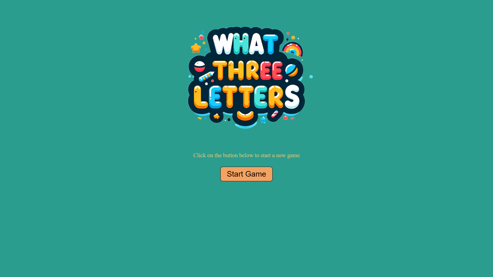

# What Three Letters - Interactive Learning App

## 🌐 Project

What Three Letters is an innovative app designed for children's reading and learning, developed as the final project for The Jump bootcamp course during a hackathon. Created by a team of five, this app is built with React and offers a playful, educational experience for young learners.

### 🏠 [Demo Link](https://what-three-letters.netlify.app/)



## ✨ Features

- **Interactive Learning Game:** Features three-letter words accompanied by images.
- **Child-Friendly Interface:** An easy-to-navigate interface specifically designed for young users.
- **Text-to-Speech Function:** A built-in text-to-speech function helps children learn how to pronounce words and letters correctly.
- **Engaging Content:** Interactive elements to maintain interest and facilitate learning.
- **React-Based Development:** Developed using React for a smooth and responsive user experience.

## 🔧 Installation and Setup

Clone the repository

```
git clone https://github.com/Gunnar50/what-three-letter.git
```

Navigate to the project directory

```
cd what-three-letter
```

Install dependecies

```
npm install
```

Start the development server

```
npm start
```

## 📚 Hackathon Challenge

This app was created within an 8-hour hackathon, where the theme and requirements were unveiled at the event's start. Our team of five tackled this challenge with enthusiasm, resulting in a fun and educational tool that was a great conclusion to The Jump bootcamp course.

## 🧠 Reflection

Developing What Three Letter was an enjoyable and enlightening experience for our team. We combined our skills to create an interactive and educational game under the unique constraints of a hackathon, highlighting the effectiveness of teamwork and the versatility of React in educational application development.

The project posed a series of challenges including:

- Brainstorming an idea
- Working in a team of five and distributing the work
- Understanding and implementing React components
- Implementing prop drilling

### 🛠️ Technology Stack

- React
- Visual Studio Code
- Node

## ⭐️ Show your support

Give a start if you liked and this project helped you!

## 📝 License

This project is open source and available under the MIT License.
